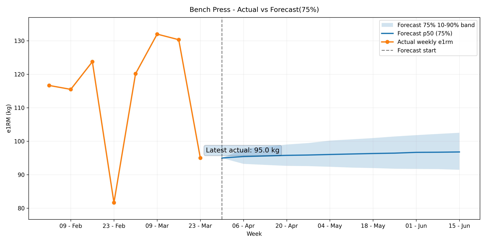
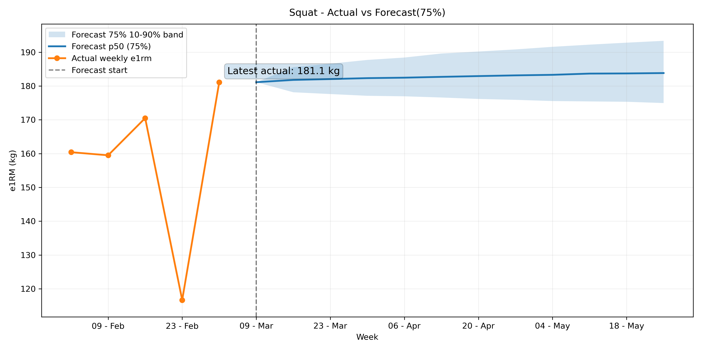
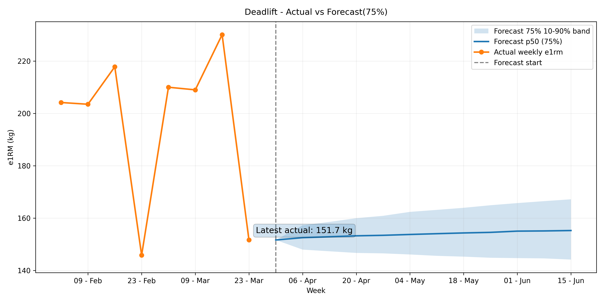

# Strength Progression Forecast

A data analytics pipeline that ingests strength training data from Google Sheets, computes weekly estimated 1RM values, and generates probabilistic forecasts of future strength progression using Monte Carlo simulation.

The project demonstrates a complete analytics workflow including data ingestion, feature engineering, forecasting, and visualization.

---

## Project Pipeline


---

## How to Run the Pipeline

Run the full data pipeline from the project root:

```bash
python src/run_pipeline.py
```

This script executes the following steps:

1. Pull latest training data from Google Sheets
2. Ingest cleaned data into SQLite
3. Compute weekly estimated 1RM values
4. Generate strength forecasts using Monte Carlo simulation

---

## Project Outputs

The pipeline generates the following outputs:

---

## Forecast Examples (75% adherence)

### Bench Press


### Squat


### Deadlift


### Raw Data
```
data/raw/strong_sets_latest.csv
```

### SQLite Database
```
data/training.sqlite
```

Tables created inside the database:

- `sets`
- `weekly_e1rm`
- `forecast_bands`
- `alerts`

### Analysis Notebooks

```
notebooks/01_weekly_e1rm_explore.ipynb
notebooks/02_pipeline_outputs_review.ipynb
```

These notebooks visualize:

- Weekly e1RM progression
- Forecast bands
- Actual vs predicted strength curves

---