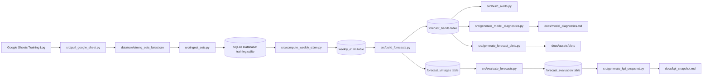

# Strength Progression Forecast

A data analytics pipeline that ingests strength training data from Google Sheets, computes weekly estimated 1RM values, and generates probabilistic forecasts of future strength progression using Monte Carlo simulation.

The project demonstrates an end-to-end analytics workflow including data ingestion, metric engineering, probabilistic forecasting, historical backtesting, diagnostics, and visualization.
---

## Project Pipeline



---

## How to Run the Pipeline

Run the full data pipeline from the project root:

```bash
python src/run_pipeline.py
```

This script executes the following steps:

1. Pull latest training data from Google Sheets
2. Ingest cleaned data into SQLite
3. Compute weekly estimated 1RM values
4. Generate probabilistic strength forecasts
5. Save forecast vintages for historical backtesting
6. Evaluate forecast accuracy against actual outcomes
7. Generate KPI and model diagnostics snapshots
8. Generate forecast plots

---

## Project Outputs

The pipeline generates the following outputs:

### Latest Strength Snapshot

This snapshot is generated automatically when the pipeline runs.

- Run: `python src/run_pipeline.py`
- Output: `docs/kpi_snapshot.md`

[View Latest KPI Snapshot](docs/kpi_snapshot.md)

### Forecast Examples (75% adherence)

#### Bench Press


#### Squat


#### Deadlift


### Raw Data
```
data/raw/strong_sets_latest.csv
```

### SQLite Database
```
data/training.sqlite
```

Tables created inside the database:

- `sets`
- `weekly_e1rm`
- `forecast_bands`
- `forecast_vintages`
- `alerts`
- `forecast_evaluation`

### Analysis Notebooks

```
notebooks/01_weekly_e1rm_explore.ipynb
notebooks/02_pipeline_outputs_review.ipynb
```

These notebooks visualize:

- Weekly e1RM progression
- Forecast bands
- Actual vs predicted strength curves

### Model Diagnostics Snapshot

This snapshot is generated automatically when the pipeline runs.

- Run: `python src/run_pipeline.py`
- Output: `docs/model_diagnostics.md`

[View Model Diagnostics](docs/model_diagnostics.md)

---

## Model Overview

This project forecasts strength progression using a Monte Carlo simulation framework with domain-informed adjustments.

Key design choices:

- Forecasts are anchored to recent **high-performance weeks**, not the latest observation, to avoid distortion from deload periods.
- Weekly performance is classified into:
  - **High weeks** (true strength signal)
  - **Low weeks** (deload/fatigue)
- Volatility (sigma) is estimated using **robust statistics**:
  - trimmed percentiles (20–80%)
  - clipping of extreme values
- Forecasts simulate multiple future paths with:
  - diminishing returns
  - adherence scenarios (100%, 75%, 50%)

This ensures forecasts reflect realistic training dynamics rather than naive time-series assumptions.

---

## Model Diagnostics

The model produces a diagnostics snapshot for transparency:

| Metric | Description |
|------|------------|
| Anchor (e0) | Starting strength level based on recent high weeks |
| Delta0 | Expected weekly gain assumption |
| Sigma | Estimated volatility (kg) |
| Forecast p50 | Median forecast for next week |
| Band width | Uncertainty range (p90 - p10) |

Example output:

| exercise    |   anchor_e0 |   delta0 |   sigma | latest_actual_week   |   latest_actual_e1rm | latest_forecast_week   |   latest_forecast_p50 |   forecast_band_width |
|:------------|------------:|---------:|--------:|:---------------------|---------------------:|:-----------------------|----------------------:|----------------------:|
| Deadlift    |      234.33 |      2   |    2.95 | 2026-04-06           |               227.5  | 2026-04-20             |                235.39 |                 10.99 |
| Bench Press |      133.73 |      1   |    1.83 | 2026-04-13           |               133.73 | 2026-04-20             |                134.26 |                  7.37 |
| Squat       |      187    |      1.5 |    2.91 | 2026-04-13           |               187    | 2026-04-20             |                187.79 |                  7.64 |

---

## Key Insights

- Raw weekly strength data contains **programmed noise** (deload weeks)
- Naive forecasting leads to:
  - underestimation of strength
  - poor coverage
- Filtering to high-performance weeks significantly improves:
  - forecast realism
  - model stability

This demonstrates the importance of incorporating **domain knowledge into modeling**.

